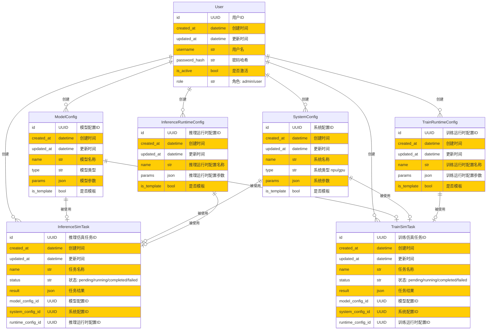

## 数据库ER图
以下是数据库的ER图，描述了用户、模型配置、系统配置、推理运行时配置、训练运行时配置以及仿真任务之间的关系：
- 用户User
    - 1个User创建0或者多个ModelConfig
    - 1个User创建0或者多个SystemConfig
    - 1个User创建0或者多个InferenceRuntimeConfig
    - 1个User创建0或者多个InferenceSimTask
    - 1个User创建0或者多个TrainSimTask

- 推理仿真任务InferenceSimTask
  - 1个InferenceSimTask使用1个ModelConfig
  - 1个InferenceSimTask使用1个SystemConfig
  - 1个InferenceSimTask使用1个InferenceRuntimeConfig

- 训练仿真任务TrainSimTask
  - 1个TrainSimTask使用1个ModelConfig
  - 1个TrainSimTask使用1个SystemConfig
  - 1个TrainSimTask使用1个TrainRuntimeConfig

- 模型配置ModelConfig
  - 1个ModelConfig被0或者1个InferenceSimTask使用
  - 1个ModelConfig被0或者1个TrainSimTask使用

- 系统配置SystemConfig
  - 1个SystemConfig被0或者1个InferenceSimTask使用
  - 1个SystemConfig被0或者1个TrainSimTask使用

- 推理运行时配置InferenceRuntimeConfig
  - 1个InferenceRuntimeConfig被0或者1个InferenceSimTask使用

- 训练运行时配置TrainRuntimeConfig
  - 1个TrainRuntimeConfig被0或者1个TrainSimTask使用

**注意：**
- 一个模型配置只能被一个训练仿真任务使用
- 一个系统配置只能被一个推理仿真任务使用
- 一个推理运行时配置只能被一个推理仿真任务使用
- 一个训练运行时配置只能被一个训练仿真任务使用
- 当配置没有被使用时，表示作为配置的输入模板

